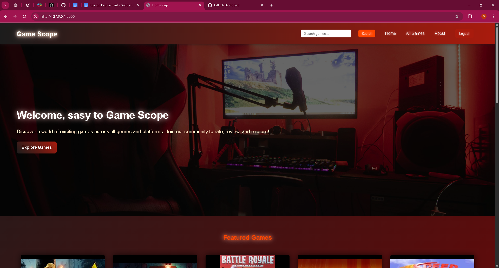
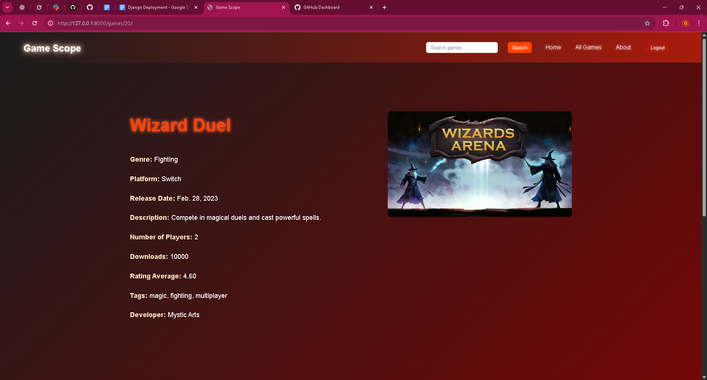
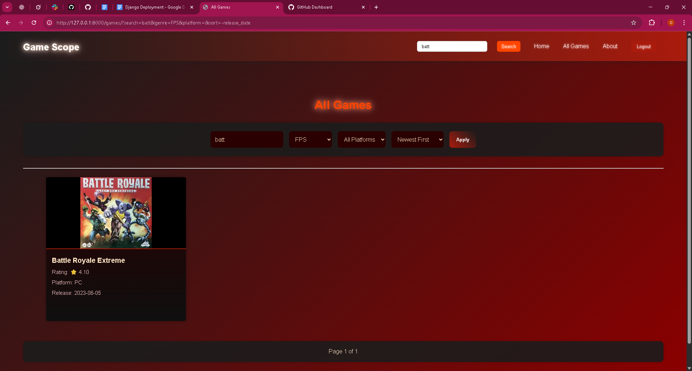
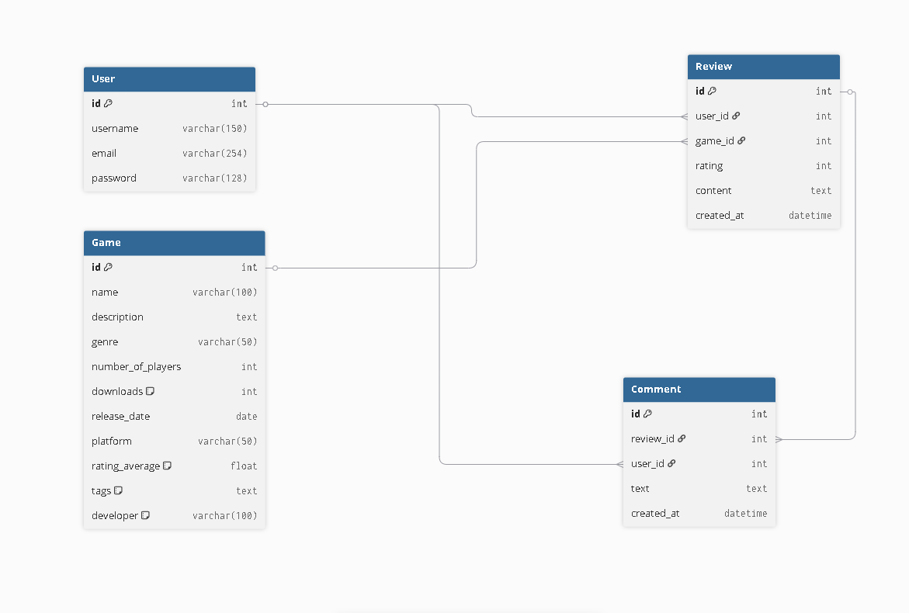

# 🎮 GameScope

**Date:** October 15, 2025, 01:57 PM +03  
**Author:** [Omar shilbaya]  

---

## 📝 Description

GameScope is a web-based platform designed to let users explore detailed game information, create and manage reviews, add comments, and interact with a community-driven review system. Built with a focus on a responsive, dark-themed interface, this app includes a search functionality to quickly find games, making it easy for users to discover and contribute to game content. The project was inspired by the need for a centralized hub to share and discuss game experiences, leveraging Django for robust backend support and custom CSS for a cohesive design.

---

## ⚙️ Technologies Used
- **Django**: For backend development and template rendering  
- **HTML**: For structuring web pages  
- **CSS**: Custom styling with variables for a consistent theme  
- **Git**: For version control  

---

## 📸 Screenshots/Logo

### 🖥️ Home Page  

### ✍️ Game Details Page  

### 🔍 Search in Action  

---

## 💡 Features
- Detailed game information display (genre, platform, rating, etc.)  
- User authentication for review and comment creation  
- Responsive form pages for adding and editing reviews/comments  
- Message system for success/error feedback  
- Comment threading with nested replies  
- Integrated search functionality to find games quickly  

---

## 🗂️ Database Design
Below is the ERD showing the relationships between models in GameScope.

---

## ⚙️ Installation
1. Clone the repository
2. Install dependencies
3. Run migrations
4. Start the development server

---

## 📝 User Stories
- **View games:** As a user, I want to view a list of available games so that I can choose which game to explore or review.  
- **Search games:** As a user, I want to search for a specific game by name or genre so that I can quickly find the game I’m interested in.  
- **Game details:** As a user, I want to view detailed information about a game so that I can learn more about its features and release details.  
- **Write reviews:** As a user, I want to write a review for a game so that I can share my personal opinion and experience with others.  
- **Read reviews:** As a user, I want to read reviews written by other users so that I can see different perspectives about the game.  
- **Comment on reviews:** As a user, I want to comment on other users’ reviews so that I can discuss and exchange opinions about the games.

---

## 🚀 Getting Started
- **Deployed App**: [Visit GameScope Live](https://gamescope-mbhm.onrender.com) *(Replace with your deployed URL)*  

---

## 🙌 Attributions
- Django documentation – framework and class-based views reference  
- MDN Web Docs – CSS and HTML best practices  
- CSS-Tricks – for responsive design guidance  

---

## 🔮 Next Steps
- Add user profile pages to track review history  
- Implement a star-based rating system  
- Enhance mobile responsiveness with touch-friendly controls  
- Enhance the style of the comments and reviews sections 

---

## 🧑‍💻 Author
**Name:** [omar shilbaya]  
**GitHub:** [OmarSalah885](https://github.com/OmarSalah885)

---
